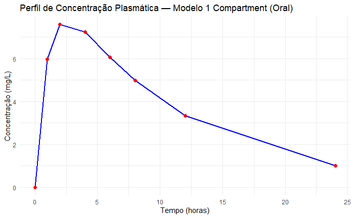
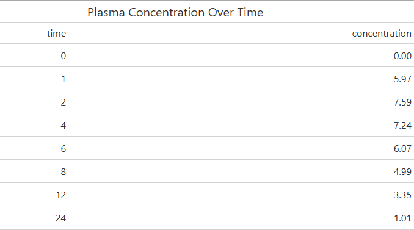
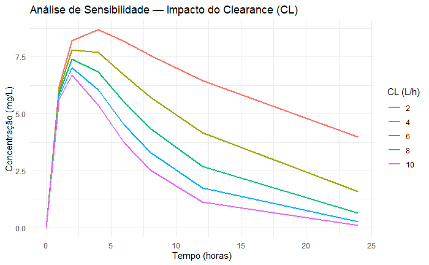
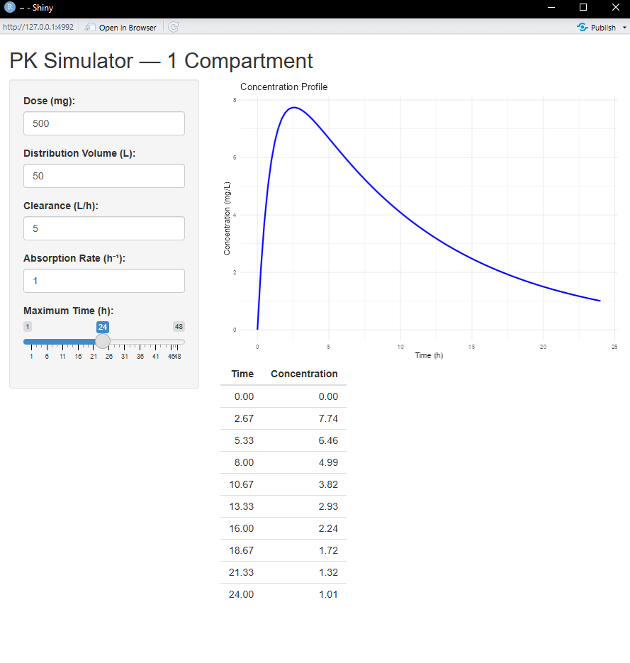

# 🧪 pkpd-simulator  
**Simulate & Visualize Drug Concentration-Time Profiles for Pharmacokinetic (PK) Analysis**

> An R-based tool for simulating and interactively visualizing pharmacokinetic profiles — ideal for pharmaceutical and biopharmaceutical companies, CROs, and quantitative pharmacology researchers.


---

## 💡 What Is It?

A PK simulation engine in R that enables users to:

- ✅ Model plasma concentration over time (e.g., 1-compartment, oral/IV)
- ✅ Visualize profiles with `ggplot2`
- ✅ Automatically generate reports using `rmarkdown`
- ✅ (Optional) Explore scenarios interactively via `shiny`

Fully reproducible, open-source, and aligned with pharmacokinetic modeling best practices.

---

## 📦 Technologies

- **R** (`deSolve`, `ggplot2`, `tidyverse`)
- **Reporting**: `rmarkdown`, `gt`
- **Interactivity**: `shiny`
- **Data Input**: CSV files containing PK parameters (dose, V, CL, ka)

---

## 📊 Example Output

### Plasma Concentration Profile


### Plasma Concentration Table


### Sensitivity Analysis — Impact of Clearance


---

## 🖥️ Interactive Shiny App

Explore clinical simulation data interactively.



> 🔍 *Click the image above to view the full demo (if available).*

## ▶️ How to Run

```r
# 1. Clone the repository
# 2. Install dependencies
install.packages(c("deSolve", "ggplot2", "tidyverse", "rmarkdown", "gt"))

# 3. Generate the report
rmarkdown::render("analysis.Rmd", output_format = "html_document")
